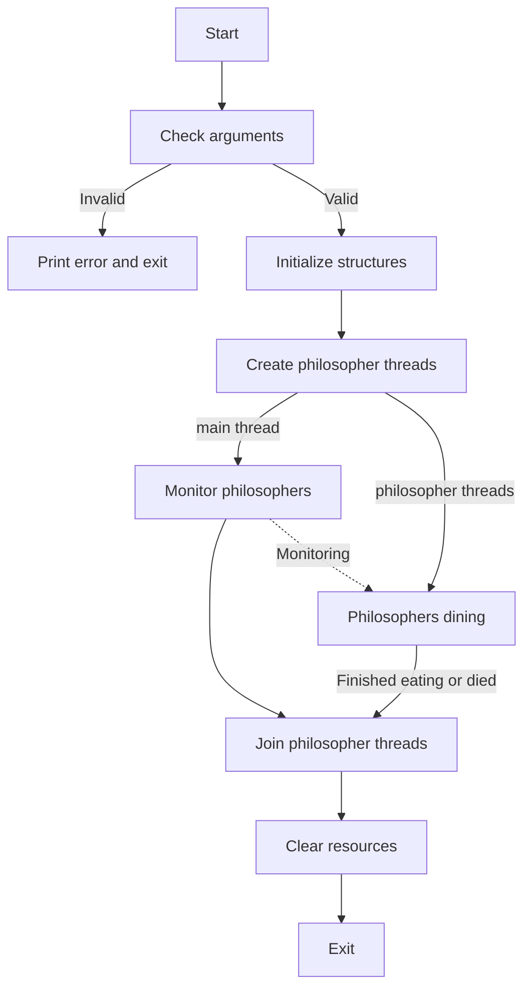
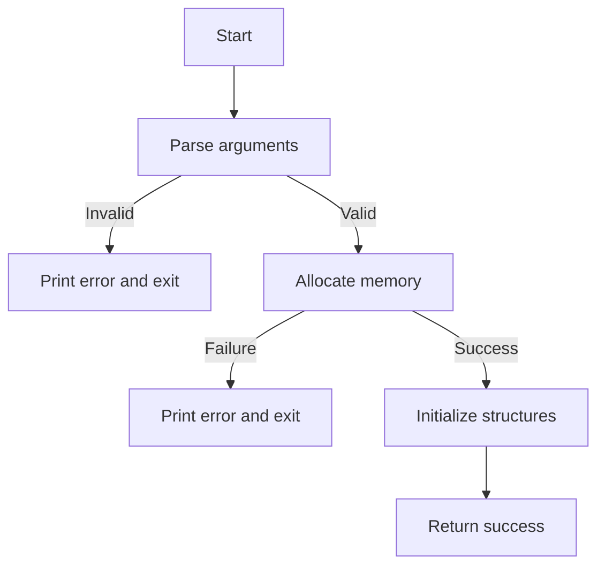
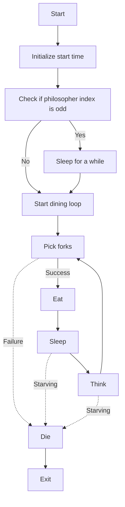
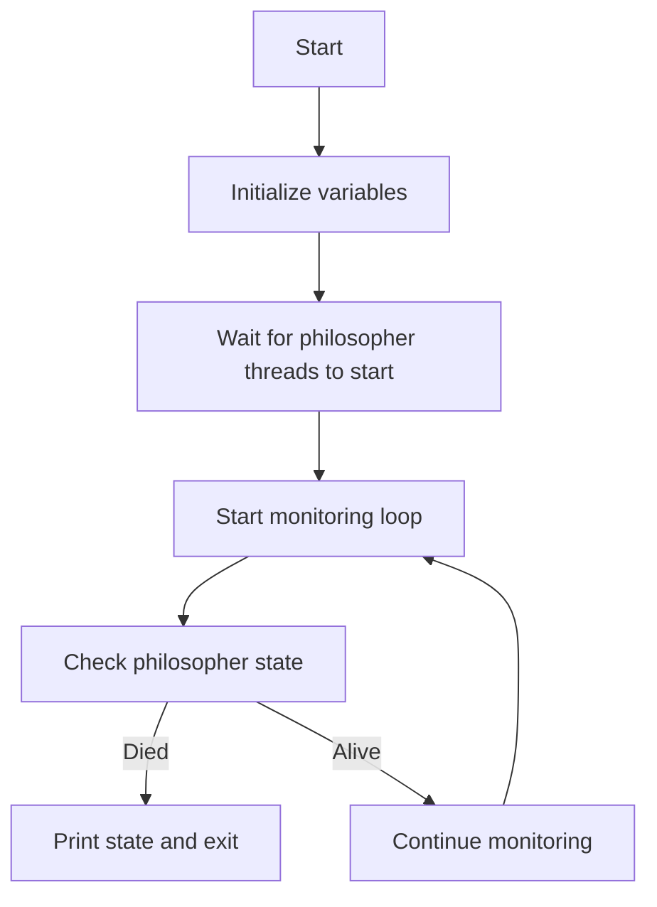

# Philosophers

## 목차

- 전체 실행 과정
- 각 단계별 주요 실행 과정
    1. Initialize structures
    2. Philosophers dining
    3. Monitor philosophers

## 전체 실행 과정

### 프로세스 개요



### 구현: `main()`

```c
int	main(int ac, char **av)
{
	t_info		info;
	t_malloc	m;
	int			i;

    // 1. Check arguments & Initialize structures
	if (ac < 5 || ac > 7)
	{
		write(STDERR_FILENO, "error : invalid number of arguments\n", 36);
		return (EXIT_FAILURE);
	}
	if (malloc_and_init(av, &info, &m) < 0)
		return (EXIT_FAILURE);
	i = -1;

    // 2. Create philosopher threads & Philosophers dining
	while (++i < info.args[0])
		pthread_create(&m.threads[i], NULL, dining, &m.philosophers[i]);

    // 3. Monitor philosophers
	monitoring(m.philosophers, &info);

    // 4. Join philosopher threads & Clear resources
	while (i-- > 0)
		pthread_join(m.threads[i], NULL);
	clear(&info, &m);

    // 5. Exit
	return (EXIT_SUCCESS);
}
```

## 1. Initialize structures

### 프로세스 개요



### 구현: `malloc_and_init()`

```c
int	malloc_and_init(char **av, t_info *info, t_malloc *m)
{
	int	i;

    // 1. Parse arguments
	i = 5;
	while (i-- > 0)
	{
		info->args[i] = _atoi(av[i + 1]);
		if (info->args[i] < 0)
			return (-1);
	}

    // 2. Allocate memory
	info->fork = malloc(sizeof(pthread_mutex_t) * info->args[0]);
	m->threads = malloc(sizeof(pthread_t) * info->args[0]);
	m->philosophers = malloc(sizeof(t_philo) * info->args[0]);
	if (!info->fork || !m->threads || !m->philosophers)
		return(malloc_err(info, m));

    // 3. Initialize structures
	init(info, m->philosophers);
	info->fin = 0;
	pthread_mutex_init(&info->fin_mutex, NULL);
	gettimeofday(&info->start_time, NULL);

    // 4. Return success
	return (0);
}
```

## 2. Philosophers dining

### 프로세스 개요



### 구현: `dining()`

```c
void	*dining(void *arg)
{
	t_philo	*p;

	p = (t_philo *)arg;

    // 1. Initialize start time
	gettimeofday(&p->last_eat, NULL);

    // 2. Check if philosopher index is odd
	if (p->idx % 2 == 1)
		usleep(250 * p->info->args[1]);

    // 3. Start dining loop
	while (1)
	{
		if (pick_fork(p, p->info) < 0)
			return (NULL);
		if (eat(p, p->info) < 0)
			return (NULL);
		if (sleep_and_think(p, p->info) < 0)
			return (NULL);
	}
	return (NULL);
}
```

## 3. Monitor philosophers

### 프로세스 개요



### 구현: `monitoring()`

```c
void	monitoring(t_philo *philosophers, t_info *info)
{
	int finish;
	int	i;
	t_philo	*p;

	// 1. Initialize variables & Wait for philosopher threads to start
	finish = 0;
	i = 0;
	usleep(500 * p->info->args[1]); 

	// 2. Start monitoring loop
	while (!finish)
	{
		i = i % info->args[0];
		p = &philosophers[i];
		pthread_mutex_lock(&p->eat_mutex);

		// 3. Check philosopher state
		if (!p->eating && get_time(p->last_eat) > info->args[1])
		{
			print_state(info, p, NULL);
			finish = 1;
			if (info->args[0] == 1)
				pthread_mutex_unlock(&info->fork[0]);	
		}
		pthread_mutex_unlock(&p->eat_mutex);
		i++;
	}
}
```